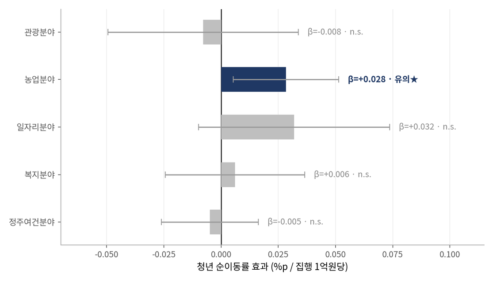
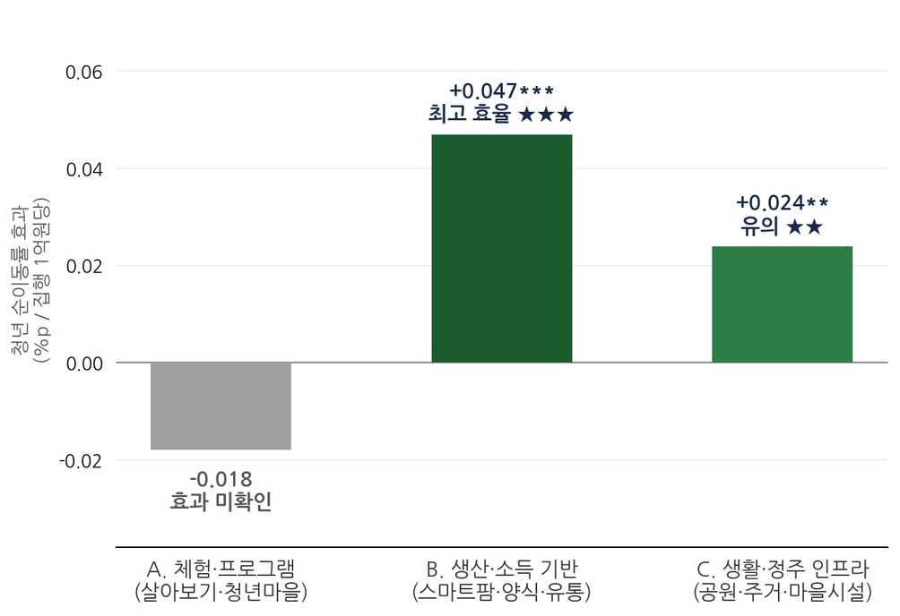
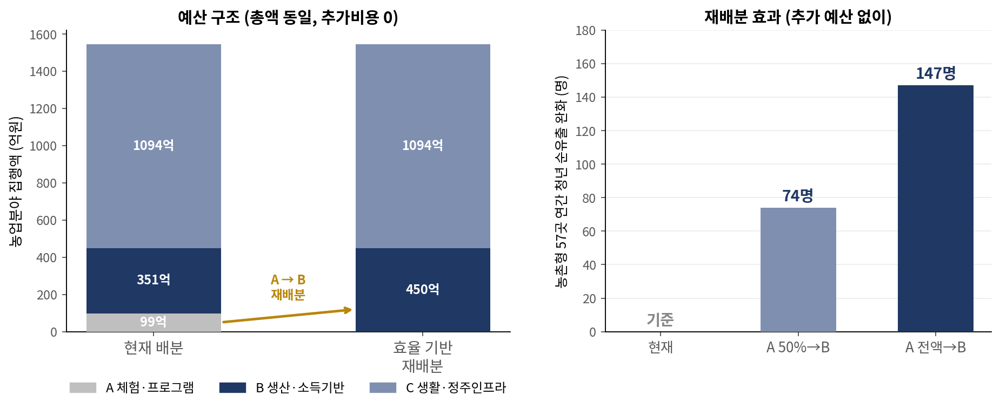

# 지방소멸대응기금 청년유입 효과 분석

기획예산처·한국재정정보원 주최 재정데이터 분석 대학(원)생 경진대회 **장려상** (2026)

## 분석 개요
매년 약 1조 원이 배분되는 지방소멸대응기금을 **어느 분야에 배분해야 청년 유출이 완화되는지**를
79개 기초지자체 × 6개 연도(474관측) 패널 데이터로 추정했습니다.

- **데이터**: 지방재정365 세출 Open API, KOSIS 인구이동·지역특성, 행안부 정보공개청구 배분현황
- **방법**: 지역·연도 이원 고정효과 패널회귀 (지역 클러스터 표준오차)
- **검증**: 시행 전후 추세분석, 성향점수매칭, 재표본 추출 200회, 플라시보 검정 등 6종

## 주요 결과
- 5대 분야(관광·농업·일자리·복지·정주여건) 중 **농업에서만 유의한 효과** (β=+0.028, p=0.017)
- 농업 사업 266건을 성격별로 분해한 결과, **생산·소득 기반 사업이 생활 인프라 대비 1억 원당 약 1.9배 효율**
- 체험·프로그램형 사업은 효과가 확인되지 않음
- 배분 조정만으로 농촌형 57개 지역에서 **연 약 147명분의 청년 순유출 완화** 가능 (추가 예산 0원)


    
    

## 파일
| 파일 | 설명 |
|---|---|
| `팀_LDL_분석코드.ipynb` | 분석 전 과정 (데이터 로드 → 회귀 → 강건성 검증, 14단계) |
| `팀_LDL_분석코드.html` | 실행 결과 포함 (설치 없이 바로 열람 가능) |
| `master_treated_v3.csv` | 분석용 패널 데이터 (79지역 × 6년) |

## 재현 방법
```bash
pip install pandas numpy statsmodels linearmodels scikit-learn matplotlib
```
노트북과 CSV를 같은 폴더에 두고 위에서부터 실행하면 동일한 결과가 나옵니다.

## 한계
수혜지역 내부 비교이므로 기금 자체가 아닌 **배분 강도의 효과**로 해석하며,
귀농귀촌 지원 등 동시 정책은 통제하지 못했습니다.

## 역할
팀 LDL 프로젝트이며, 본인은 **데이터 수집·전처리, 데이터 분석 및 시각화**를 담당했습니다.
